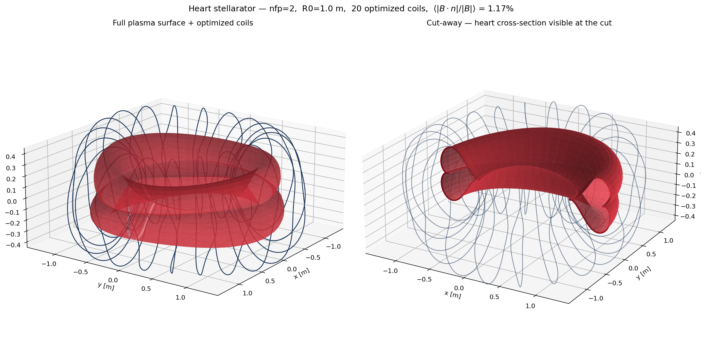
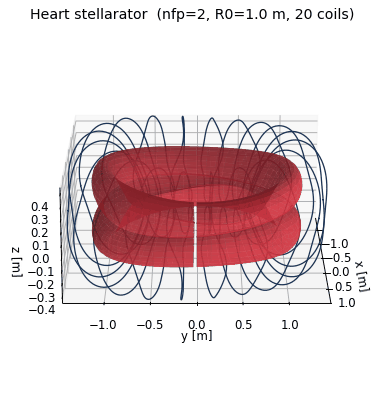
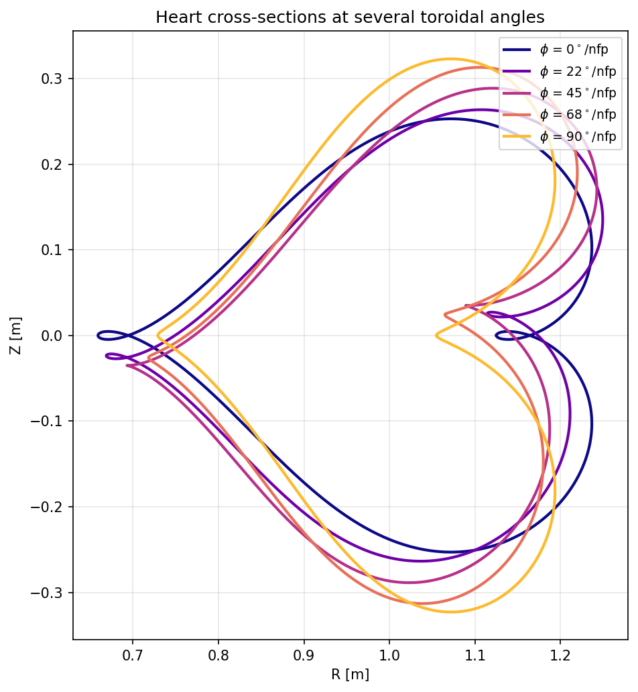

# heart-stellarator

A stellarator with the cross section of a heart.



The plasma boundary's poloidal cross-section traces the classical
parametric heart curve

```
x(t) = 16 sin³(t)
y(t) = 13 cos t − 5 cos 2t − 2 cos 3t − cos 4t
```

Rotated 90° in the (R, Z) plane so the heart's symmetry axis lies on the
equatorial plane, the curve is *already* a finite Fourier series and drops
straight into a `SurfaceRZFourier` with no fitting — five `R_{m,0}` modes
and two `Z_{m,0}` modes give the shape exactly. A small `n=1` modulation
adds the toroidal twist that turns this from a heart-tokamak into a real
2-field-period stellarator. Five modular coils per half-period are then
optimized against the surface with L-BFGS-B until `⟨|B·n|/|B|⟩ ≈ 1%`.

## Result





The cut-away on the right of the title figure shows the heart cross-section
at the slice plane. The cross-sections plot above shows how the heart
morphs as you move through one half-field-period — the `n=1` twist rotates
and deforms it.

## How it's built

| File | Purpose |
|---|---|
| `heart_stellarator.py` | Designs the heart surface, optimizes coils, renders plots (and the GIF with `--gif`) |
| `Dockerfile` | Debian-slim + C++ toolchain (gcc / cmake / ninja); SIMSOPT built from source |
| `docker-compose.yml` | Two services (`heart`, `heart-gif`); working directory bind-mounted so outputs land on the host |

`simsopt` is compiled from source (the PyPI aarch64 wheel uses CPU
extensions Colima's VM doesn't expose); `pybind11` is pinned `<3` so the
vendored xtensor compiles.

## Run it

```bash
docker compose build                  # one-time
docker compose run --rm heart         # static plots
docker compose run --rm heart-gif     # also write the rotating GIF
```

Outputs land in the working directory:
`heart_stellarator.png`, `heart_cross_sections.png`, `heart_stellarator.gif`.
